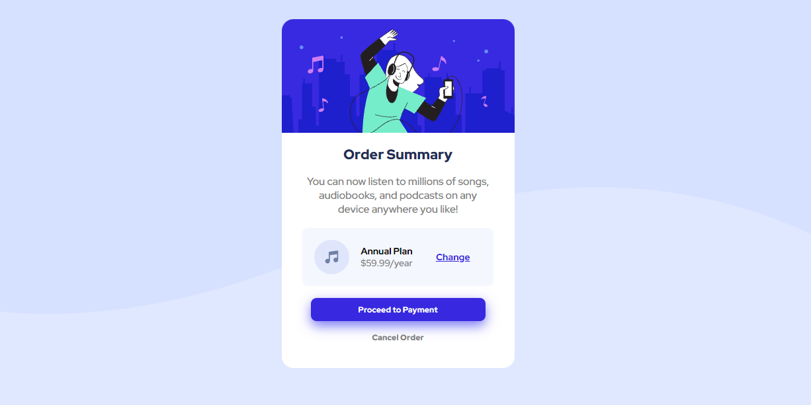

# Frontend Mentor - Order summary card solution

This is a solution to the [Order summary card challenge on Frontend Mentor](https://www.frontendmentor.io/challenges/order-summary-component-QlPmajDUj). Frontend Mentor challenges help you improve your coding skills by building realistic projects. 

## Table of contents

- [Overview](#overview)
  - [The challenge](#the-challenge)
  - [Screenshot](#screenshot)
  - [Links](#links)
- [My process](#my-process)
  - [Built with](#built-with)
  - [What I learned](#what-i-learned)
  - [Continued development](#continued-development)
  - [Useful resources](#useful-resources)
- [Author](#author)


**Note: Delete this note and update the table of contents based on what sections you keep.**

## Overview

### The challenge

Users should be able to:

- See hover states for interactive elements

### Screenshot




### Links

- Solution URL: [Add solution URL here](https://github.com/lhcastro/ordersumarycomponent)
- Live Site URL: [Add live site URL here](https://your-live-site-url.com)

## My process
- After setting up the enviroment. I started with the background, and then tried my best to get the elements the same as the design from top to bottom. 

### Built with

- Semantic HTML5 markup
- CSS custom properties
- Flexbox


### What I learned

This was my first challange, and it was usefull to get me more comfortable with css

I learned how to set a svg file as a pattern for the background

```css
.body {
  background: #E0E8FF url(/images/pattern-background-desktop.svg) repeat-x right top;
}
``` 
and how a simple shadow-box can drastically improve the visuals of a webpage


```css
.button {
  box-shadow: 0 0.4rem 1rem hsla(241, 85%, 68%, 0.87) ;
}
```


### Continued development

I still need to learn more about how to layout better the elements, and learn how to use the css grid, sice right now I am using only css display:flex to layout everything. 

### Useful resources

- [Example resource 1](https://www.w3schools.com/cssref/default.asp) - This helped me to get some css reference. 


## Author

- Website - [Luiz Henrique Castro](https://www.lhcastro.com)
- Frontend Mentor - [@lhcastro](https://www.frontendmentor.io/profile/lhcastro)
- Twitter - [@lhcastro4468](https://www.twitter.com/lhcastro4468)


